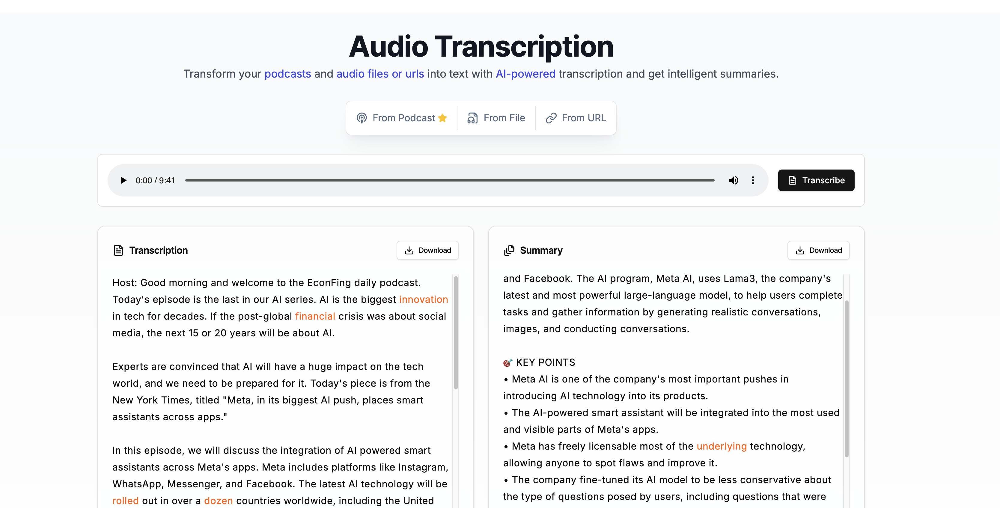

# Audio Notes Player


An audio transcription and notes player based on Next.js and OpenAI Whisper API. It supports local audio playback, timestamped transcripts, AI-generated shownotes, chapters, highlights, and click-to-seek navigation.

## ✨ Features

- 🎯 Support both file upload and URL input
- 🎙️ Support for Xiaoyuzhou podcast transcription
- 📝 High-quality audio transcription using OpenAI Whisper API
- 📊 AI-powered content summarization
- 🧭 AI-generated shownotes with chapters and highlights
- ⏱️ Click chapters, highlights, or transcript segments to seek audio playback
- 🎨 Modern UI design
- 💾 Download transcripts and summaries
- 🎵 Built-in audio player
- 🖥️ CLI tool support (`pt` command)
- 📋 SRT subtitle format output
- 🔄 Chunked processing for large audio files
- ⚡ Parallel transcription for better performance
- 📤 Multiple output formats (text, JSON, markdown, SRT)

## 📦 CLI Installation

### Install via npm

```bash
npm install -g @winterfx/pt
```

### Configure API Key

Choose one of the following methods:

**Option 1: Environment Variable (Recommended)**
```bash
# Add to ~/.zshrc or ~/.bashrc
export API_KEY="your-api-key"
export BASE_URL="https://api.openai.com/v1"  # optional
```

**Option 2: Config File (~/.pt/.env)**
```bash
mkdir -p ~/.pt
cat > ~/.pt/.env << 'EOF'
API_KEY=your-api-key
BASE_URL=https://api.openai.com/v1
EOF
```

**Option 3: Current Directory (.env)**
```bash
cat > .env << 'EOF'
API_KEY=your-api-key
BASE_URL=https://api.openai.com/v1
EOF
```

## 🚀 Web App Development

### Prerequisites

- Node.js 18+
- FFmpeg (required for audio processing)
- Python 3.9+ for local transcription with faster-whisper
- OpenAI API Key or another compatible text model endpoint for AI shownotes

#### Installing FFmpeg

```bash
# macOS
brew install ffmpeg

# Linux (Ubuntu/Debian)
sudo apt-get install ffmpeg

# Windows
choco install ffmpeg
```

### Local Transcription Setup

The app uses local `faster-whisper` transcription by default. The fastest MVP runtime is:

```txt
model: small
device: cpu
compute type: int8
```

For better podcast accuracy, especially Chinese audio, use `medium + cpu + int8` if you can accept slower transcription:

```txt
model: medium
device: cpu
compute type: int8
```

Create the Python environment and install the local transcription dependency:

```bash
python3 -m venv ~/.cache/audio-notes-player/whisper-venv
~/.cache/audio-notes-player/whisper-venv/bin/python -m pip install -r scripts/requirements-whisper.txt
```

Download and initialize the default fast model:

```bash
~/.cache/audio-notes-player/whisper-venv/bin/python -c "from faster_whisper import WhisperModel; WhisperModel('small', device='cpu', compute_type='int8')"
```

Download and initialize the higher-accuracy CPU model:

```bash
~/.cache/audio-notes-player/whisper-venv/bin/python -c "from faster_whisper import WhisperModel; WhisperModel('medium', device='cpu', compute_type='int8')"
```

Optional environment variables:

```env
TRANSCRIPTION_PROVIDER=local
FASTER_WHISPER_MODEL=small
FASTER_WHISPER_DEVICE=cpu
FASTER_WHISPER_COMPUTE_TYPE=int8
FASTER_WHISPER_PYTHON=/absolute/path/to/python
FASTER_WHISPER_INITIAL_PROMPT=以下是中文播客或访谈内容，请使用简体中文准确转写，保留专有名词和口语表达。
```

Use the UI language selector. Choosing `中文` passes `zh` to faster-whisper and applies the default Chinese initial prompt.

Set `TRANSCRIPTION_PROVIDER=openai` only if you want to use the OpenAI Whisper API path instead of local transcription.

### Installation

1. Clone the repository:
```bash
git clone https://github.com/yourusername/podcast-transcription.git
cd podcast-transcription
```

2. Install dependencies:
```bash
npm install
# or
yarn install
# or
pnpm install
```

3. Configure environment variables:
Create a `.env.local` file and add:
```env
OPENAI_API_KEY=your_openai_api_key
OPENAI_BASE_URL=https://api.openai.com/v1
```

`API_KEY` and `BASE_URL` are also supported for compatibility.

The OpenAI key is still used by the MVP shownotes generator. Local faster-whisper handles audio transcription.

4. Start the development server:
```bash
npm run dev
# or
yarn dev
# or
pnpm dev
```

Visit [http://localhost:3000](http://localhost:3000) to view the app.

### MVP Workflow

1. Open the web app.
2. Import audio from a local file, direct audio URL, or Xiaoyuzhou podcast URL.
3. Click `Transcribe`.
4. After transcription finishes, the app generates structured shownotes.
5. Click any chapter, highlight, or transcript segment to jump the audio player to that timestamp.
6. Use `MD` to export shownotes as Markdown, or use the transcript download controls for TXT/SRT.

### Docker Deployment

1. Build the Docker image:
```bash
docker build -t podcast-transcription .
```

2. Run the container:
```bash
docker run -p 3000:3000 podcast-transcription
```

## 🖥️ CLI Tool

The project includes a command-line tool `pt` for transcribing audio files directly from the terminal.

### CLI Usage

```bash
pt <input> [options]
```

**Arguments:**
- `<input>` - Local file path or audio URL

**Options:**
- `-s, --summary` - Generate AI summary after transcription
- `-l, --language <lang>` - Language code: `auto`, `en`, `zh`, etc. (default: `auto`)
- `-o, --output <file>` - Output file path (default: stdout)
- `--output-format <format>` - Output format: `text`, `json`, `markdown`, `srt` (default: `text`)
- `-q, --quiet` - Suppress progress output

### CLI Examples

```bash
# Transcribe a local audio file
pt /path/to/podcast.mp3

# Transcribe with AI summary
pt podcast.mp3 --summary

# Generate SRT subtitles
pt podcast.mp3 --output-format srt -o subtitles.srt

# JSON output with summary
pt podcast.mp3 --summary --output-format json -o result.json

# Transcribe from URL
pt https://example.com/audio.mp3 --summary
```

### Running the CLI

```bash
# Via npm script
npm run pt <input> [options]

# Or after global install
npm link
pt <input> [options]
```

## 🤝 Contributing

Pull Requests and Issues are welcome!

## 📄 License

MIT License - See [LICENSE](LICENSE) file for details.

## Star History

[](https://star-history.com/#winterfx/Podcast-Transcription&Date)
